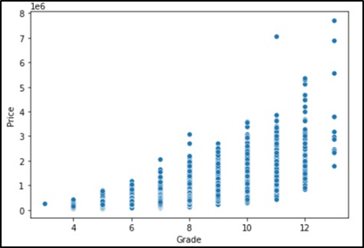

# Platform for Prediciting House Sales Price in USA
Apex Realty is a web based online real-estate platform that provides instant price valuation of properties in the United States using the features of the property provided as inputs by customers through the platform. Initially as a startup company, we are planning to build regression models which can predict the property sales prices in Washington DC at the initial stage, and we will update the model which will cover other states for expanding our business model. The historic data was collected from Kaggle data source named as “KC_Housesales_Data” which provide necessary data for houses sold in Washington DC over a period of 2 years. Data Cleansing, pre-processing and transformation were performed before the model preparation.  We performed exploratory data analysis to elicit meaningful insight from the dataset that can help our business in making better decisions and to explore the dataset to understand about any trends, correlations, or patterns among variables. For building the predictor model we created a hist gradient boosting model, which is a tree-based model and Elastic Net linear regression model. We compared these models to determine which one is performing the best to predict the sales prices of houses, and we concluded that Hist-gradient boost model was most effective in predicting the sales price of houses, with an R2 score of 0.90. However, we can improve the model in future by collecting more data and incorporating supplementary features such as income level of the community, infrastructure availability, population density, cost of living, average sales price of neighborhood houses etc. 

# PROBLEM DESCRIPTION 
1. Business Goal
Our business focus on building a user-friendly Platform where clients can get quick and fair evaluations for properties as per the features of the houses. Our immediate goal is to build a model which can accurately predict the house prices in Washington DC and later on, expand the model to the other states of United States.
2. Data Analysis Goal
Building an effective and reliable model which can predict sale price of properties in the Washington D.C with given features with an R2 value of at least 0.80.
3. Data Description
We collected the data from “Kaggle datasets” named as “KC_Housesales_Data”. The link of the data: KC_Housesales_Data | Kaggle
4. Dimensions and Overview of the Data
The data contains 21 variables and 21597 observations. The various input variables or independent variables are given in table below.

The dependent variable in the dataset is price of property, which is an integer type. In this model, we focus to predict the price using other input variables. The data collected of the time period 2014 - 2015.

# EXPLORATORY DATA ANALYSIS  
When we conduct an exploratory data analysis and we used Tableau, Power BI, and python to analyze the dataset and to plot main graphs between various variables.
4.1 Average Price of Properties as per cities in Washington D.C

From the above figure, we can see that the average property price in the cities of Medina and Mercer Island are high compared to other cities, with $2.16 million and $1.19 million respectively.

4.2 Scatter Plot between Sq. ft. Living and Price

From the scatter plot, it’s clear that price of the house increases as the sq.ft. living increases and also it is evident from the plot that most of the houses have sq.ft. living area between 2000 and 5000 sq.ft.

4.3 Box Plot between number of Bedrooms v/s Price

From the above plot, we can see that as the grade of the property increases, the prices become exceptionally high. Higher the grade, better the property and hence the prices.

4.4 Correlation Matrix
The strength and linear connection of all independent factors with the dependent variable is investigated using a correlation matrix. 

From the above correlation Matrix, it’s found that dependent variable “Price” has high correlation (0.4 or high) with square feet living, Bathrooms, Grade, Square feet above etc.

4.5 Heat-Map of Price with Respect to Cities

The above heat map, the average sales price for houses is high near to the Seattle region of Washington D.C which also the largest city in Washington D.C.

5. DATA PREPARATION
As part of data preparation, we performed data quality checks, cleaned the dataset, and transformed the data and various treatments were performed on the dataset to prepare the dataset for modelling.
5.1 Null Value Detection
When we checked for null values using python, we found that the dataset does not contain any null values. 
5.2 Data Transformation 
Because of quality concerns, capitalization and removal of excess white spaces were performed. We also created a new column named ‘city’ to map city names from another dataset based on zip codes.
5.3 Outlier Treatment 
One of the main issues we faced with the dataset, was to identify outliers and this had to be conducted for each individual feature. From the treatment, we received the following insights:
	The datapoint with 33 bedrooms is an outlier because it has a square lot area of 6,000 only and has only 1.75 bathrooms and square feet living area is less, which makes it practically impossible and thus can be considered as an entry mistake.
	The data point with the square feet lot area of 1,651,359 has been removed from the dataset because square feet lot area is extremely large in comparison to square feet living and square feet lot15, when compared to data related to houses in that neighborhood which have lot sizes of 420,000 only.
	Data points for house prices above 6 million where not outliers as prices can be high due to good grade and high no. of bedrooms and bathrooms but are not good for our model as most of the data points in our dataset have houses with the price ranging between 2-3 million due to which including data points where price is more than 6 million can adversely affect the model performance. Hence, we will consider the data points near the average sales price for an effective model. In future, after collecting more data around high valued houses, we can create a different model that will account for expenses houses as well.
5.4 Dropped Irrelevant Columns 
We dropped ID, City, Zipcode, Date and Yr_renovated features from the dataset as they were not making any significant impact on our target variable i.e., Price. City and Zipcode were dropped as they were similar and had commonalities with Latitude and Longitude features. Yr_renovated was dropped as it had many data points as 0 which indicated that the houses were not renovated.

6. DATA ANALYSIS SOLUTION
For our data analysis solution for predicting the house sale prices, we created two models, out of which one was tree based and the other one was linear regression model. We split the data into training set (80%), and test set (20%). Training set will be used to fit the model, and test set will be used to evaluate the model and measure the performance of the models.
6.1 Elastic Net Regression Model
We scaled the data using standard scaler from scikit learn to ensure all features are on the same scale. We performed Hyper Parameter tuning using Grid Search and cross validation on training set and encoded the categorical features into a variable. Then we found l1 and alpha. After cross-validation on the training set, we observed that the model is performing the best when alpha is 0.01 and l1 is 1.0. Our model’s performance is decent on the trained set with Adj. R2 of 0.72. For this model, we are getting 0.72 R2 score and RMSE as 190,964.05 and MAE as  121,186.82.

6.2 Hist-Gradient Boosting Model
We first attempted to create a model with all features included and the R2 score on test set was found to be 0.90 and RMSE was found to be 117072.96 and MAE was 68814.86.  But, when we checked feature importance, we found that the features bedrooms, floors, and sq. ft are least important features in dataset and thus we optimised the model by dropping these features. to see that the R2 score is still 0.90 but the RMSE and MAE values got reduced to 115462.16 and MAE to be 67982.64.				
We performed Hyper parameter tuning and cross validation on the training set and observed that the model is performing at its best when l2 is 0.8. We checked for the residual errors and found that model is over-predicting the prices of cheap houses and under-predicting prices of expensive houses. This can be resolved by adding more data points from the high and low ranges and adding more informative features, such as prices of the houses in the neighbourhood, income of neighbourhood, etc.

6.3 Model Comparison

Hist-Gradient Boosting Model is having better R2 score with about 0.90 than Elastic Net with R2 0.73.

According to Hist-Gradient Boosting Model - Latitude, Longitude, Sqft_living, Grade are the most important features affecting the sales price of the houses. According to Elastic Net Model - Lat, Grade, Sqft_living, Sqft Above are the most important features affecting the sales price of the houses.
6.4 Output Comparison
The R2 score, RMSE and MAE is clearly better for Hist-Gradient Boosting Model than Elastic Net. For Elastic Net model, we need to did data pre-processing to achieve these results, but Hist-Gradient Boosting Model required minimal pre-processing and gave much better results with minimal work. In addition, Hist-Gradient Model is not overfitting because the test set performance is consistent with training set performance. Hence, Hist-Gradient Boosting model is much more effective than Elastic Net with R2 of 0.90 which shows that it’s excellent in predicting the sales prices of houses.
7. CONCLUSION
To conclude, Hist-Gradient Boosting model is far better than Elastic Net Model and should be used for our platform where customers can receive reliable and accurate predictions of the sales prices of their properties by inputting the required feature information. This is because Hist-Gradient Boosting requires minimal pre-processing and gives much better results and is also not overfitting as its test and training set performance are consistent with R2 score of 0.90.
8. RECOMMENDATION
1.	We can improve our model by collecting more data around the sales prices of houses in Washington DC and other states of the US to expand our data solution to all the states and getting more reliable results.
2.	We can make our model perform even more effective by better hyperparameter tuning and ensembling.
3.	We can add more features to the model such as neighborhood house sales prices, income of neighborhood, population, infrastructure information like Schools, Hospitals, Transport connectivity, Lakes, shopping complexes, multiplexes etc.

